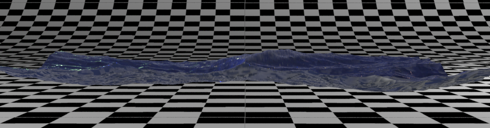
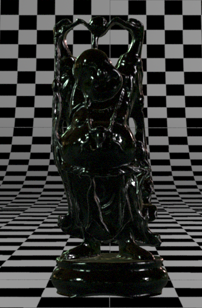
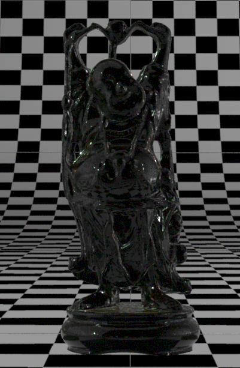
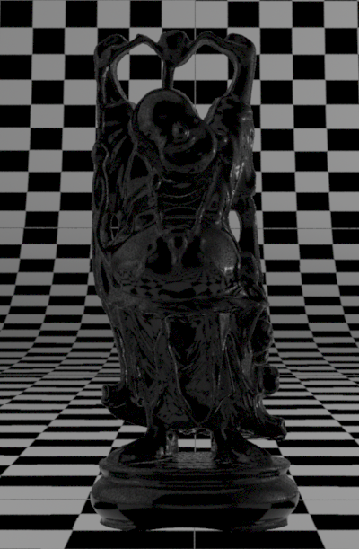
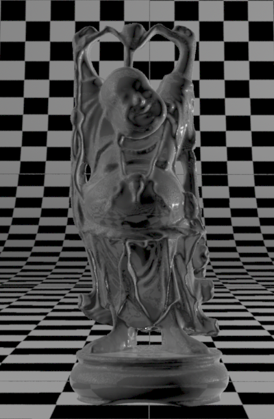
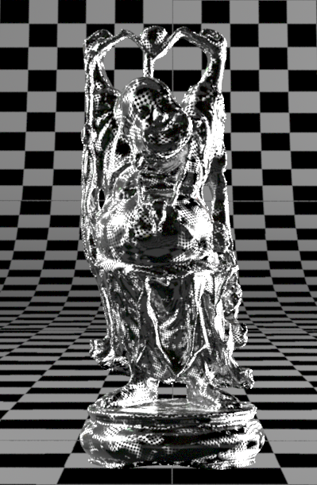
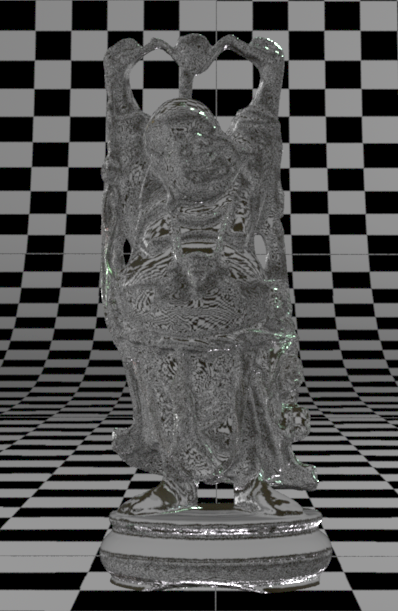

Collection of RSL Renderman shaders
===========

A selection of old Renderman shaders I wrote back in 2013.

Surface shaders
-------
- **mwCarPaint** - procedural car paint shader with shellac ("flakes") layer
- **mwGlass** - simple glass shader
- **mwLeaf** - procedural leaf shader (with alpha cut-out)
- **mwLeather** - simulates natural leather using procedural displacement
- **mwOcean** - procedural ocean shader based on 3Delight's Maya ocean shader implementation
- **mwProduction** - full production shader combining multiple shading models (OrenNayarWolff diffuse, Ward anisotropic reflections, CookTorrance specular), few custom AOVs for separate diffuse, specular, reflection, refraction, world-point, normal-point and camera-point outputs

Displacement shaders
--------------------
- **mwGerstnerWaveDisplacement** - more complex ocean wave displacement model
- **mwWaveDisplacement** - simpler ocean wave displacement shader

Screenshots
-----------

Credits
-------
I managed to learn a lot by looking at every possible source scattered around the Internet. I tried to mention the original authors of some functions, but my memory can be elusive. I'd like to say big thanks to:

- prof. Malcolm Kesson (fundza.com)
- Larry Gritz
- Brian Meanley
- lollipopshaders.com

